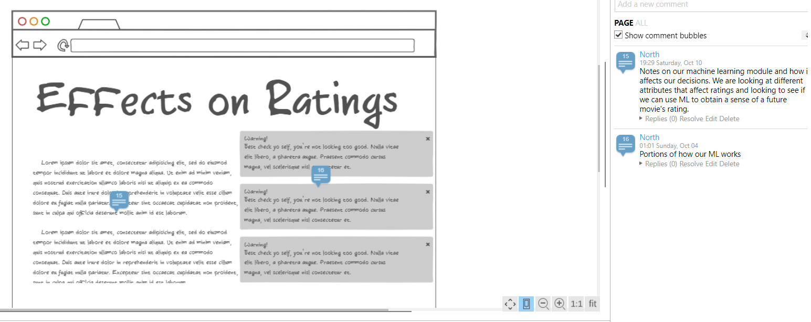

# Movie Ratings and Genres

Perform analysis on movie ratings and genres

Communication Tools: Slack, Zoom Meetings, 

Information Sharing: Google Drive/Colab, Github, 

## Reason for Project

COVID situations and mandatory stay at home requirements exponentially put high demand on streaming platforms. If there is a way to predict past movie ratings and genre trends over a period of duration, it could be one of the good sources to provide user-based recommendations relevant to years on streaming platforms. 
testing master and individual branches

## Project Plan/Expectations

The source data has lot of potential with various features. The data comprises movie titles, imdb ids, rating, genres, release years. Through this project we plan to focus on following business predictions/questions:

1. Predict popular movie genres within certain release period and intricate genres relationships based on release years.
2. Predict if movie runtime affects ratings (analysis discrepancies on votes
2. If higher ratings are driven by popular directors?

Steps:
1.  Use ETL pipeline to cleaning and transforming the data:
    * Encode the columns, split the genres, and clean up categorical feature as required.
2.  Database connections
3.  Pre-processing steps:
    * Feature scaling
4.  Create ML model:
    * Perform Linear Regression model
    * Perform Random forest model
    * Compare the statistics between the models and identify model with better accuracy
5.  Predictions and Conclusions

## Data Exploration Phase:

Movie data pulled from: https://www.imdb.com/interfaces/

Through this segment, we explored 4 data sets;
1. Movie_akas: has information tconst, ordering, title, region, language, types, attributes, isOriginalTitle
2. Movie_basics: tconst, titleType, primaryTitle, originalTitle, isAdult, startYear, endYear, runtimeMinutes, genres
3. Movie_ratings: tconst, averageRating, numVotes
4. Movie_crew: tconst, directors, writers

The tconst being common imbd_id across all data sets that helped with merge, each data set has promising information for analysis. 
Inline-style: 

Top picks for project are title, start year (release year), runtime minutes, genres, average ratings, number of votes, and directors.

## Data Analysis & Cleaning: 

1.	Several pre data cleaning steps were completed on a merged dataframe, that contained the 4 above mentioned files, in Jupyter Notebook. These cleaning steps included dropping all rows that were not movies (TV shows, videogames, etc…), converting the data type for some columns, dropping movies that were older than 1950, dropping movies that had NaN in the runtime and genres columns. A final list of unique tconst values was extracted from the cleaned dataframe and this list was used to filter each individual data file, so they each contained only the movie rows we needed, before the four files were loaded into the DB and merged.
2. A connection was made to our local Postgres server and the clean individual files were updated and the tables were merged into a single movie_analysis_db database. All tables are left joined on tconst to produce common table movie_data_sql (movie_data in pandas data frame)
3. Additional data cleaning steps were carried out on the final dataframe, which included encoding certain columns using MultiLabelBinarizer, dropping unneeded columns after encoding, and renaming column names.
4. All machine learning modals will be execute on this final data frame.

## Machine Learning Analysis: 

features on runtime and average rating in movies.
1. Use Supervised Learning to analysis and predict. 
2. Build three models as: linear regression model, logistic regression model, and SVC model.
3. Fit the model with predicted datasets, and use confusion matrix to report its accuracy and model performance. 

## Machine Learning Second Segment Summary:

Short Summary:
1. Linear regression model is completed correctly. For the linear regression model, we did a loss function to analyze its accuracy for the third segment deliverable.
2. The Classification model has imbalanced datasets problem, so we need to take oversampling to re-scale the data. In that way, the model performance is not accuracy. For Classification model, need to use oversampling method to deal with imbalance data in third segment deliverable. 

Third segment deliverable to do list:
1. use RMSE or R-square to analysis the linear regression model performance.
2. use SMOTEENN method to deal with the imbalance datasets.
3. Add random forest decision tree models to re-predict the models
4. add feature importance 
5. compared the F-1 score and evaluate the model performance
6. add writing description for ML model analysis. 
7. add Logistic Regression and SVC model visualization. 

Presentation:
1. Create a dashboard displaying effects of different datasets on ratings.

ERD from QuickDBD: https://app.quickdatabasediagrams.com/#/d/YUIU3s

Mock Storyboard: https://ninjamock.com/s/N37F6Gx (note: please activate comments to see explanations within the storyboard)

   The overall objective is to look into factors affecting ratings
   We are potentially looking at:
   
      1. Genres on Rating
      2. Director on Rating
      3. Runtime on Rating
      
   Rating is being utilize as a stand in for popularity. This may allow us to decide which
   films can be used to attract new customers and increase membership.
   
   To start off we'll splash (do storyboard artists speak like this?) the first page with a background on the factors that we will be looking at to affect ratings. We will also
   cover the route we plan to take the ML models to get a sense of a future movie's ratings [possibly]. The presentation will also show off a sample of the data we will be using. There will finally be spcific pages for the factors that we look at that affect ratings. In our conclusion we will look at what we learned from the process, and how we can improve our ML and what we can potentially use the new information for.
   
   The dashboard is expected to be built utilizing the Tableau software. It is expected that the dashboard will be created to be displayed on a HTML page.
   
   Below are sample slides:
   
   
   
